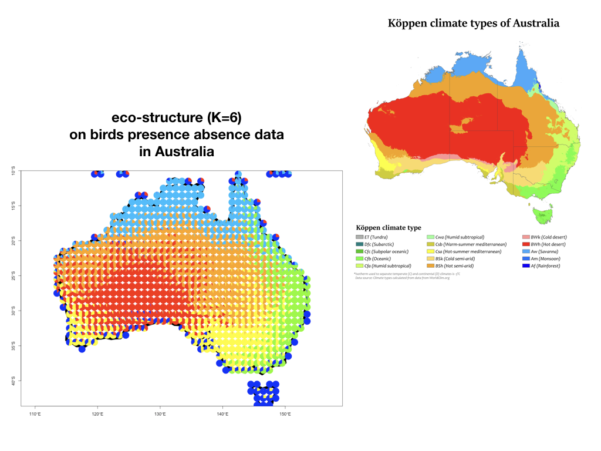
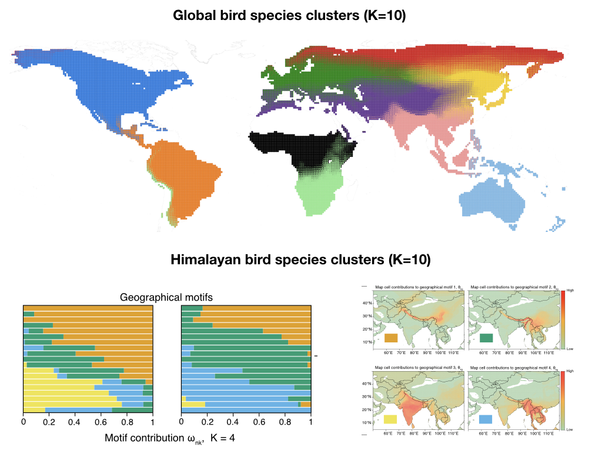

# ecostructure
R package for Visualizing Structure in ecological site-species abundance data

This package is targeted at fitting [STRUCTURE](http://www.genetics.org/content/155/2/945)
type model on ecological species abundance and presence-absence data both at local
and large geographic scales - together with high quality visualizations of the fitted
model.

### Authors 

- [Kushal K Dey](https://kkdey.github.io) 
- Alexander E White

### Installation

Install **ecostructure** following the instructions below.


```R
install.packages(devtools)
devtools::install_github("kkdey/ecostructure")
```
Then load **ecostructure**

```R
library(ecostructure)
```

### Illustration

ecostructure for K=6 on Australian birds - presence absence data.




How well does it approximate the climate structure !!

Other example illustrations are




### Workflow

If you want to try **ecostructure**, see our tutorial here.

### Citation

If you find **ecostructure**, please cite us at

### Questions?

For any queries or concerns related to the software, you can open an issue [here](https://github.com/kkdey/ecostructure/issues). Or you can contact 
us. Kushal Dey - *kshldey@gmail.com* or Alex White -
*aewhite100@gmail.com*.

We thank our mentors Prof. Matthew Stephens and Prof. Trevor Price
for helpful suggestions and discussions. 

You are also most welcome to contribute to **ecostructure** !!


