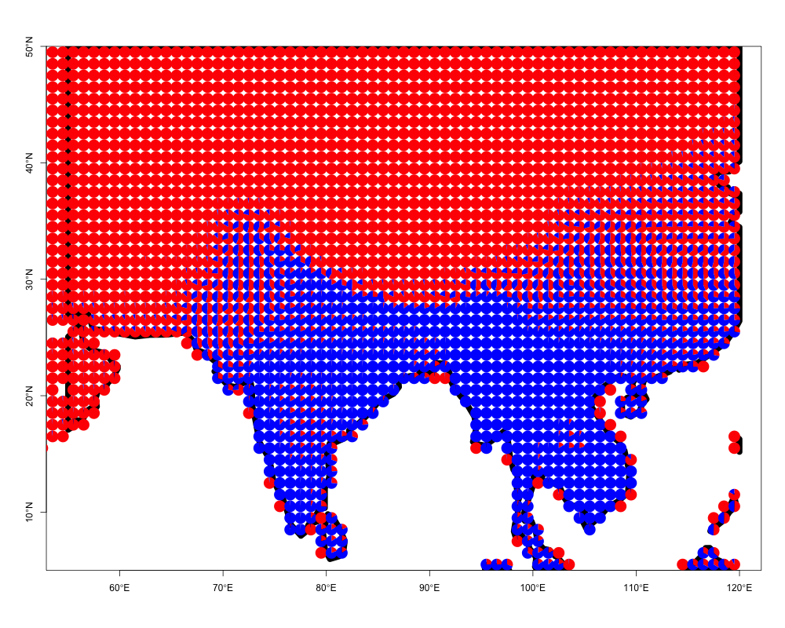
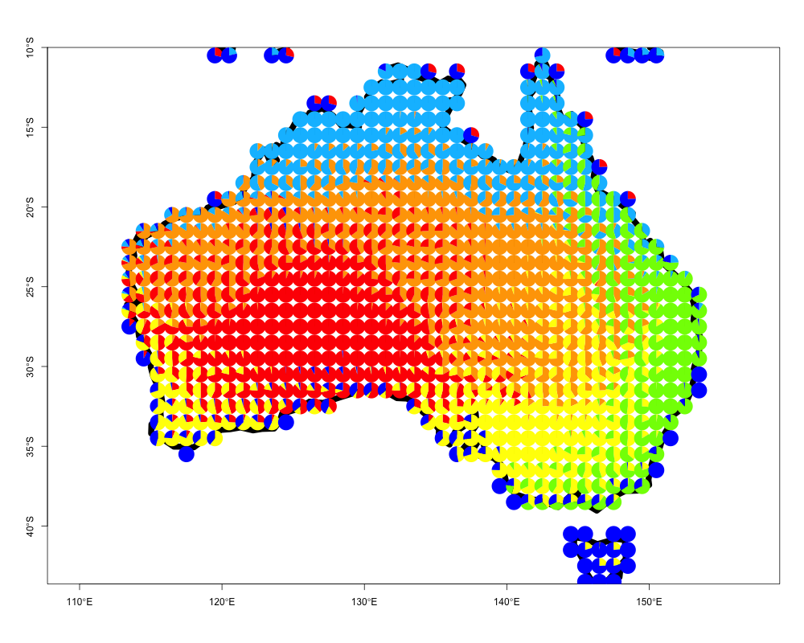

# Introduction

**ecostructure** is an R package for clustering and visualizing structure in ecological
assemblages using Mixed Membership or Grade of Membership (GoM) models (see [reference](https://www.stat.washington.edu/sites/default/files/files/reports/2006/tr492.pdf)). The package can incorporate data on different spatial scales - assemblages can
reflect species abundances in local communities (e.g., data in community ecology and microbiomics) or presence and absence of species across continent(s) (e.g., macroecology and biogeography). **ecostructure** also allows phylogenetic, geographic, and trait data to be incorporated in the clustering framework, producing clusters along different axes of bio-diversity, which we call *motifs*. 


This tutorial focuses on the analysis of bird assemblages at global and local scales, 
showcasing the use of these tools and methods to assess the turnover of species across samples and illustrate that turnover with visualizations. 

The main contributions of the **ecostructure** package are as follows 

- Functions to cluster species abundance and species presence/absence data by fitting GoM models.
  
- New methods for visualizing the structure of species assemblages (e.g., communities or biotas), leveraging the output from the appropriate GoM model. 
  
- Tools to process species level data using a phylogeny, a trait dataset, or a GIS dataset in order to examine the contribution of history, function, and geography to species level structure.

The analytical framework provided by **ecostructure** is employed in our accompanying [paper](White et al. 2018). The paper focuses on a survey of bird species abundances at 38 local sites across the all elevations in the eastern and western Himalaya, the data from which is provided as part of this package.  

# Installation

## System requirements

**ecostructure** requires core geospatial libraries supporting the use of 
GIS data in R - GDAL ($>= 2.0.1$), GEOS ($>= 3.4.0$), and PROJ.4 ($>= 4.8.0$).
Typically these libraries get automatically installed as part of the dependency
packages to **ecostructure**.

**ecostructure** requires access to the "gfortran" library. Mac OS X users may 
encounter the error "library not found for -lgfortran" when installing. To fix this
error, please follow the instructions at this [link](https://thecoatlessprofessor.com/programming/rcpp-rcpparmadillo-and-os-x-mavericks--lgfortran-and--lquadmath-error/).


## R requirements

**ecostructure** requires R version $>= 3.4.0$

To install **ecostructure**, follow the steps below

```{r echo=TRUE, eval=FALSE}
source("https://bioconductor.org/biocLite.R")
biocLite("Biobase")
install.packages("devtools")
devtools::install_github("kkdey/ecostructure")
```

This will install **ecostructure** along with all its dependencies. 

Next, load the package into R.

```{r warning=FALSE, message=FALSE}
library(Biobase)
library(ecostructure)
```

A comprehensive list of all the functions in the **ecostructure** package can be found
by running the following command.

```{r echo=TRUE, eval=FALSE}
help(package = "ecostructure")
```


# Himalayan Bird Surveys 

We present the abundances of birds in 38 five ha forest patches across elevations 
in both the eastern and western Himalayas, together with the site metadata. There 
are 304 species in the dataset, and species morphological trait data 
(species means) are also presented along with a time-calibrated phylogeny of 
those species. For methods related to measuring traits and building the phylogeny,
see this [paper](https://www.nature.com/articles/nature13272) for details).

The data is saved as an ExpressionSet object and can be read as follows

```{r}
data("himalayan_birds")
```

One can extract the *species abundance matrix* as follows 

```{r}
species_counts <- t(exprs(himalayan_birds))
t(species_counts)[1:10,1:5]
```

The *site metadata* for the Himalayan sites - describing elevation,
east/west, latitude, and longitude - can be extracted as follows.

```{r}
site_metadata <- pData(phenoData(himalayan_birds))
head(site_metadata)
```

Finally, the *species metadata*, comprising the means of the bill traits, 
wing size, tarsus and mass of each species, can be read as follows

```{r}
species_metadata <- pData(featureData(himalayan_birds))
head(species_metadata, 4)
```

Besides the survey data, **ecostructure** also provides the presence absence matrix
for all breeding birds in southeast Asia, encompassing the region of the survey sites in the above data. This data has been prepared from publicly available shapefiles (.shp) from [BirdLife International](http://www.birdlife.org/).

```{r}
data("indian_birds_pa")
```


# Model fitting and Visualizations

The `ecos_fit` function fits Grade of Membership models either 
on binary presence-absence data or species abundance counts data. We illustrate 
each case below.

## Species abundance data

We use `ecos_fit` to evaluate structure in our Himalayan birds dataset.
These data are counts of species in sites, and so the function fits a Multinomial model
to generate *species abundance motifs*. The data structure (abundance or presence/absence)
is evaluated by the function automatically.


```{r message=FALSE, warning=FALSE}
set.seed(1000)
fit <- ecos_fit(species_counts, K = 2, tol = 0.1, num_trials = 10)
```

The function outputs a lower rank representation of the data in `species_counts`, 
according to the value of K chosen by the user. Above, we chose to examine the primary
partition of the data into 2 motifs by setting `K` = 2. Increasing `num_trials` will run
more burn-in trials for the model fit, and decreasing `tol` will make the underlying algorithm
run longer before convergence. These may need to be modified if the input data matrix is small. 

The main components of the output from `ecos_fit` are: 

- `omega` : A site $\times$ K matrix, K representing the number of clusters 
          or species abundance motifs. The row sums equal 1 and the entries 
          are positive. These represent the contribution of the different
          motifs to the composition (i.e., species abundance distribution) of each site.
          
- `theta` : A species $\times$ K matrix, where the column sums equal 1. These values
          represent the contributions of each species to each motif k.

### Vizualing motif contributions to sites     

We can take the output from the model fit and visualize the motif 
contributions matrix `omega` using a stacked bar chart. 

```{r fig.height=5, fig.width= 6, fig.align='center'}
east_west_dir <- factor(site_metadata$WorE, levels = c("W", "E"))
elevation_metadata <- site_metadata$Elevation
ecos_blocks(fit$omega,
                    blocker_metadata = east_west_dir,
                    order_metadata = elevation_metadata)
```

Because we are interested in species turnover across elevational and geographic locations, we block the two elevational gradients (western or eastern) and plot 
them side by side. 

This blocking structure (`blocker_metadata`) can be used for any environmental 
gradient of interest, allowing replicates or experimental treatments (in our case, geographic location) to be easily visualized together. `order_metadata` determines the order of the stacked bars in each block. Other parameters can be customized to modify the axes, titles, etc.

See `ecos_plot_pie` below to plot the data in a spatially explicit context (i.e., on a map).

### Identifying species contributions to motifs

A central component of this framework is assessing the species contributions to 
each motif. One may be tempted to merely examine the `theta` matrix component of the
model fit, and identify the the species that differentially drive the clustering.

We use the function `ExtractTopFeatures` from the R package [CountClust](http://bioconductor.org/packages/release/bioc/html/CountClust.html) to compute and record the top contributing species to each species abundance motif.

```{r}
features <- CountClust::ExtractTopFeatures(fit$theta, top_features = 5,
                                           method = "poisson", options = "max")
t(apply(features$indices, c(1,2), function(x) return(rownames(fit$theta)[x])))
```


### Comparing observed fit to null expectation

One may also want to compare the clustering of the original data to that of randomly
generated null matrices of species abundances. We provide a way to compare the observed model fit to null model fits of various types. Randomized matrices of are generated internally using the `randomizeMatrix` function in the package
[picante](https://cran.r-project.org/web/packages/picante/picante.pdf).

```{r}
out <- ecos_nullmodel(species_counts, K=2, null.model = "richness",
                              iter_randomized= 10, option = "BF")
```


## Presence-absence data

Here we describe how to cluster species using a presence-absence data matrix of 
species across the globe or sub-regions of the globe. 

The matrix may represent be local data or macroecological data (species in a 1$^\circ$ $\times$ 1$^\circ$ map cell) - for functions to generate these data using GIS data sources (shapfiles or geodatabase files) see other sections below. 

We again use `ecos_fit` to fit Grade of Membership models on binary presence-absence data using a Binomial/Bernoulli model. We refer to the clusters/motifs obtained by this procedure as *species motifs*.

```{r echo=TRUE, eval=FALSE}
data("indian_birds_pa")
pres_ab_fit <- ecos_fit(indian_birds_pa, K = 2, tol = 0.1)
```

The above code takes around 4 minutes to run on a single machine. 

Again, the function outputs a lower (specified by K) rank representation of the data `indian_birds_pa`. The output `pres_ab_fit` consists of  `omega` and `theta` 
components and these matrices can be understood as: 

- `omega` : A site $\times$ K matrix, K representing the number of clusters 
          or species motifs. The row sums equal 1 and the entries 
          are positive. These represent the contribution of the different
          motifs to the species composition of each location.
          
- `theta` : A species $\times$ K matrix, where each species has a probability of 
            being found in the kth motif. These probabilities are *not* constrained to             sum to 1 as in the multinomial case we illustrated earlier.
            
We have an example model fit of the above function run as part of the
**ecostructure** package.

```{r}
data("pres_ab_fit")
```

### Vizualing species motif contributions 
        
We can take the output from the model fit and again visualize the membership 
proportions `omega`. However, as the data may consist of thousands of spatially explicit locations, we do not use `ecos_blocks` as in the previous example, but instead use the function `ecos_plot_pie`, which incorporates latitudinal and longitudinal coordinates of the original sites. We plot the `omega` matrix in a spatial context as follows.

```{r}
ecos_plot_pie(omega = pres_ab_fit$omega,
                      lat_lim = c(5,50),
                      long_lim = c(55,120),
                      path = "geostructure_plot.png",
                      color= c("red","blue"))

```

This function will create a file `geostructure_plot.png` in the current folder
(`getwd()` in R to figure out).



One can easily apply this to any region of interest. We provide an
example of visualizing species presence-absence structure as generated by applying
the binomial GoM model with $K=6$ on the bird species presence absence matrix
from Australia. Again these data have been processed from [BirdLife International](http://datazone.birdlife.org/species/requestdis)

```{r message=FALSE, warning=FALSE}
data("australia_model")
ecos_plot_pie(omega = australia_model$omega,
                      coords = australia_birds$latlong, 
                      long_lim = c(110,160),
                      lat_lim = c(-50,-10),
                      path = "geostructure_plot_aus.png",
                      color= c("orange", "red", "yellow", "deepskyblue", 
                               "chartreuse", "blue"))

```

The plot should look as follows 



## Geographic contributions to local communities

**ecostructure** offers tools for users to examine how local patterns of community structure are related to potential geographic sources. One way to interpret the geographic inputs into a given site is to generate a site's dispersion field by overlapping the geographic distributions of the species present at the site. 

### Generating dispersion fields for local sites

For a given dataset of local species presences (can be abundances but dispersion fields are generated based on presence), we can generate dispersion fields for each site and again fit a GoM model. These methods require some types of GIS data source, either shapefiles of species distributions, a geodatabase of species distributions (as in the .gdb of global bird species ditrbutions provided by BirdLife International), or even point occurences of species presences in a region. 

We generate dispersion fields for our 38 sites using the function `dsp_create_from_survey`. 

```{r, eval=FALSE}

## If GIS data are in the form of separate shapefiles (.shp)

local_him_disp <- dsp_create_from_survey(local_data = species_counts,
                              gis_data_type = "shp",
                              shp_dir = {PATH TO directory with species shapefiles})

## If GIS data are in the form of a geodatabase (.gdb)

local_him_disp <- dsp_create_from_survey(local_data = species_counts,
                              gis_data_type = "gdb",
                              gdb_dir = {PATH To Directory with Species Geodatabase})
```

`dsp_create_from_survey` takes a local data matrix and a specified GIS data type to produce dispersion fields in a specified regions. The function reads in shapefiles for each species (or a .gdb for all species) and rasterizes those distributions for a given resolution. There are many arguments to customize so be sure to examine the documentation for this function. The output 'local_him_disp' consists of 3 objects. 

- `raster` : A list of rasters representing the dispersion fields for each site (length is the number of rows (sites) in `local data`) at the specified resolution.
            
- `precise` : A list of rasters representing the dispersion fields for each site (length is the number of rows (sites) in `local data`) at the resolution of the argument `precise`. These could be used for plotting high resolution 
dispersion fields. 
            
- `matrix` : A list of the same rasters is `raster` but in matrix form. These are used for easily processing the dispersion fields into the structure required to fit a GoM model. 

### Visualizing dispersion fields

We can generate maps for all of the disperison fields using the function `dsp_plot_map`. We provide the dispersion fields for our 38 Himalyan community
surveys, `dispersion_field_ex`, as a list of matrices.

```{r}
data("dispersion_field_ex")
dsp_plots <- dsp_plot_map(dispersion_field_ex, 
                    raster_latlim = c(5, 50), raster_longlim = c(50, 120), 
                    scale = "percentage")
dsp_plots[[1]]
```

`dsp_plots` is now a list of plots, each of which visualizes the dispersion fields from our local sites.

### Processing dispersion fields for GoM model fit

We can easily process the dispersion fields into one data matrix by using `dsp_to_matrix`

```{r}
dsp_fields_matrix <- dsp_to_matrix(dispersion_field_ex)
```

The output from `dsp_to_matrix` is a data matrix with rows equivalent to each site's dispersion field as a vector.

```{r}
dim(dsp_fields_matrix)
```

Each column is a map cell in the region of interest, with the value being a count from each site of how many species from that site overlap the cell.

### GoM model and visualization of dispersion fields

As these data are counts, we can now fit a multinomial GoM (using to examine *geographic motifs*. In this case, `omega` is a matrix of motif contributions to dispersion fields, and the `theta` matrix represents each map cells contrbution to each
of the motifs. We can plot the `theta`s on a map, showing the contribution of each map cell to the motif. Some biologists may think of these motifs as analagous to the regional inputs into local communities. 

The model fit is done using `ecos_fit` as above. Because this geographic data matrix may be particularly large, depending on the resolution chosen to produce the dispersion fields, the fit may take longer than the fit on the original data matrix. 

```{r, eval = F} 
fit <- ecos_fit(dsp_fields_matrix, K = 2, tol = 0.1, num_trials = 10)
```

We can plot the theta distributions of each geographical motif using the function `dsp_motif`. We provide an example theta matrix with the package called `example_theta`.

```{r}
data("example_theta")
himalayan_geo_motifs <- dsp_motif(example_theta, 
                                  color_ramp = c("black", "darkseagreen3",
                                                 "orange","red"),
                                  dsp_fld_res = 8)
himalayan_geo_motifs$motif_maps[[1]]
```

We call this color palette the *Ghostbusters theme* !! :)


## Incorporating phylogenic and trait information

The relationships between species, either phylogenetically or functionally, are an important component in evaluating ecological structure. We provide two functions, one for phylogenies and one for trait data, that collapse species into either clades or functional groups based on a desired cut off.

### Phylogeny

We load the time-calibrated phylogenetic tree `phylo_tree` of the 304 Himalayan birds in `species_counts`. We then collapse the species into clades to based on certain time point cut off on the tree `collapse_at`. Below we cut the tree off at 10 million years ago.

```{r}
data("phylo_tree")
phylo_counts <- ecos_prepare_by_phylo(species_counts, phylo_tree, collapse_at = 10)
dim(phylo_counts$outdat)
```

### Traits

We use morphological trait metadata from `himalayan_birds` data and then use the distance metric based on these traits to collapse the bird species as above. As in the case of the time component above, one can set `prop_div` to a collapse the tips of trait dendrogram to produce a specific number of functional groups (the proportion of the original diversity). Below we create $91$ functional groups out of the original 304 species. 

```{r}
bill_traits <- as.matrix(dist(scale(species_metadata[,c(1:3)])))
counts_bill_traits <- ecos_prepare_by_trait(counts = species_counts, 
                                                    traits = bill_traits, 
                                                    prop_div=0.3)
dim(counts_bill_traits)
```

Both `phylo_counts` and `counts_bill_traits` can now be passed to `ecos_fit` to generate either *phylogenetic motifs* or *trait motifs*. 

## Generating a presence absence matrix

There are a number of ways to generate species presence absence data to evaluate *species motifs*.
Conservation organizations ([IUCN](http://www.iucnredlist.org/technical-documents/spatial-data), [BirdLife International](http://datazone.birdlife.org/species/requestdis), etc.) often distribute shapefiles and geodatabase that contain geographic distributions in the form of polygons. Point occurances can also be overlaid on a raster to produce a rough geographic distribution (this may be suitable for fitting GoMs at a large scale). 

We provide a function `dsp_create_from_gdb` that creates a presence absence matrix using these GIS data types. This function is slow on large datasets. We illustrate how it might be used below on the geodatabase of global bird distrbutions provided by BirdLife International.

```{r echo=TRUE, eval=FALSE}

## Request and fetch geodatabase (gdb) from BirdLife International : http://datazone.birdlife.org/species/requestdis or 

## say we call one such gdb - example_birdlife.gdb

gdb_global_birds <- st_read("example_birdlife.gdb")

## Then run the following commands to generate the presence absence matrix

disp_from_scratch <- dsp_create_from_gdb(gdb_object = gdb_global_birds,
                      raster_resolution = 1,thresh = 3,
                      raster_latlim = c(-90,90),
                      raster_longlim = c(-180,180),
                      species_feature = "SCINAME")
```

The presence absence data is output as `disp_from_scratch$pres_ab` on which `ecos_fit` can be run.

```{r echo=TRUE, eval=FALSE}
fit <- ecos_fit(disp_from_scratch$pres_ab, K = 5, 
                        tol = 0.1, num_trials = 10)
```

`dsp_create_from_gdb` also returns the dispersion fields similar to dispersion fields create. 

One may request the BirdLife dataset from [here](http://datazone.birdlife.org/species/requestdis). Presence/absence data
illustrated above was generated using this data source. 

Users may also look to other packages that specifically focus on generating presence absence data from GIS data types. [letsR](https://cran.r-project.org/web/packages/letsR/letsR.pdf) is an incredibly useful package to this end. Presence-absence matrices from **letsR** can certainly be used in tandem with the **ecostructure** functions. Our goal is to contribute to that body of work by creating a tool that employs the speed and utility of the packages [sf](https://cran.r-project.org/web/packages/sf/index.html) and [fasterize](https://cran.r-project.org/web/packages/fasterize/index.html) (see [velox](https://cran.r-project.org/web/packages/velox/velox.pdf) as well).

# Citation

If you find **ecostructure** useful, please cite our accompanying paper.

# Developers

**ecostructure** has been developed by [Kushal K Dey](https://kkdey.github.io)  and 
[Alexander E White](http://www.alexwhitebiology.com/), in the labs of
[Matthew Stephens](http://stephenslab.uchicago.edu/) and [Trevor Price](https://pondside.uchicago.edu/ecol-evol/people/price.html) labs at the University of Chicago. 

The local Himalayan bird surveys were conducted by Trevor Price and Dhananjai Mohan.

For any queries or concerns related to the software, you can open an issue [here](https://github.com/kkdey/ecostructure/issues). 

Or you can contact us directly: Kushal K Dey - *kshldey@gmail.com* or Alex White -
*aewhite100@gmail.com*.